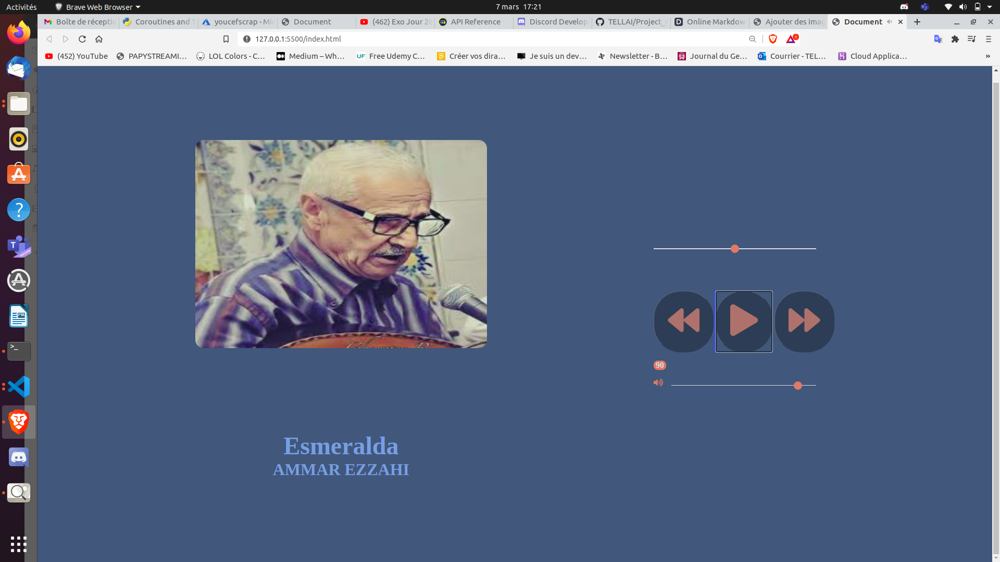

# Mini-spotify

Ce dépôt contient backend et le backend du mini lecteur spotify .

## Features

- Lancer le site dans index.html
- Ecouter une variété de musique que j'apprécie.
- Bonne écoute !

## Tech

- [Javascript] - Pour dynamiser le site notament le passage d'une musique à l'autre changement du son, de l'image et du texte.
- [HTML] - Pour la mise en page.
- [CSS] - Pour le style.

## Developement

1- Ajouter un formulaire pour ajouter des musiques
2- Stocker les musiques dans une base de données.

## Templete

